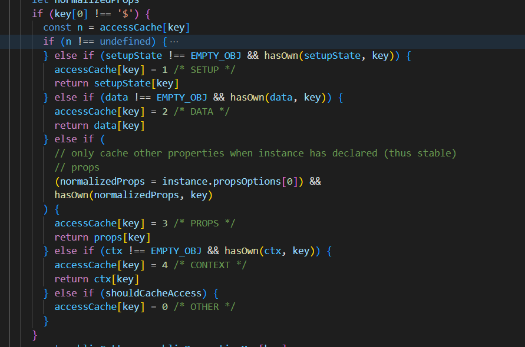

# 模板的变量取值逻辑
注：源码vue3.2+，开发环境
## vue源码中render调用位置
调用位置`renderComponentRoot`
  
render内使用with，在`proxyToUse`对象内，（with语法mdn or wangdoc.com），因此里面的变量需要是`proxyToUse`的属性，否则报错

## render调用的定义域：withProxy值
  
i是组件实例`instance`，`withProxy`是一个代理值，代理`instance.ctx`

## 找到代理的最终结果
我们只看get
  
`PublicInstanceProxyHandlers`，中的get
  

`PublicInstanceProxyHandlers`:这个拦截器决定了，取值数据，get里面做了缓存，方便每次取值，我们掠过，
所以顺序就是，`setup`,`data`,`props`,`ctx`

## ctx属性的定义
前面说了，这些属性必须定义在ctx上，上面的get只是取值逻辑，如果没有定义ctx上，（即withProxy），会报错
### 上下文属性定义(下面数据按照函数执行顺序)
#### props
函数位置`setupStatefulComponent` -> `exposePropsOnRenderContext(instance)`
  
#### setup
函数位置`setupStatefulComponent` -> `handleSetupResult(instance, setupResult, isSSR)` -> `exposeSetupStateOnRenderContext(instance)`
  
`setupState`,`setup`返回的函数
### data
函数位置`setupStatefulComponent` -> `finishComponentSetup(instance, isSSR)` -> `applyOptions(instance)`

`applyOptions(instance)`，这个函数是处理options写法的，只截取data的属性如何挂在ctx上的部分
  

